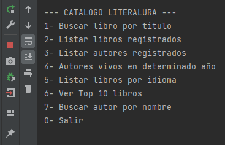
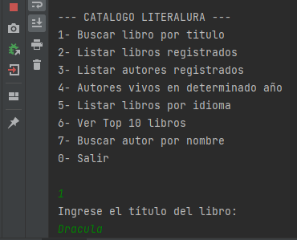
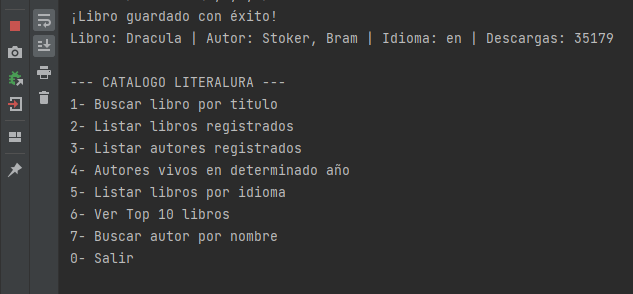
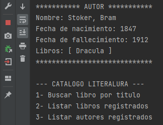

# 📚 LiterAlura - Catálogo Literario Inteligente

<p align="center">
  
  
  
  
</p>

---

## 📖 Descripción del Proyecto
**LiterAlura** es una herramienta de gestión de bibliotecas que conecta la consola de comandos con la API de **Gutendex**. Permite a los usuarios buscar libros en la web, almacenarlos de forma local y generar análisis avanzados sobre autores e idiomas.

---

## 🛠️ Stack Tecnológico

| Componente | Tecnología |
| :--- | :--- |
| **Lenguaje** | Java 17 |
| **Framework** | Spring Boot 3 |
| **Persistencia** | Spring Data JPA / Hibernate |
| **Base de Datos** | PostgreSQL |
| **Serialización** | Jackson (JSON) |
| **API Externa** | [Gutendex API](https://gutendex.com/) |

---

## 🚀 Funcionalidades Principales

### 🔍 Gestión de Búsquedas
* **Web Search:** Busca libros por título en tiempo real.
* **Filtro Local:** Localiza autores por nombre en tu base de datos personal.
* **Seguridad:** Validación de códigos de idioma (ISO 639-1).

### 📊 Análisis de Datos
* **Top 10:** Ranking dinámico de los libros más descargados.
* **Estadísticas:** Distribución porcentual de libros por idioma.
* **Línea de Tiempo:** Identificación de autores vivos en periodos históricos específicos.


---

## 🧩 Desafíos Superados

> [!IMPORTANT]
> **Optimización de Relaciones:** Se implementó una relación `@ManyToOne` bidireccional entre `Libro` y `Autor` con carga **EAGER**, permitiendo reportes detallados del autor y su bibliografía completa sin consultas adicionales.

| Reto | Solución Técnica |
| :--- | :--- |
| **Duplicidad de Autores** | Implementación de `findByNombreContainsIgnoreCase` para validación antes de persistir. |
| **Recursividad Infinita** | Personalización de `toString()` en la entidad Autor usando Java Streams. |
| **Datos Nulos** | Manejo de autores "presentes" mediante lógica condicional en el filtrado de años. |

---

## ⚙️ Configuración e Instalación

1. **Base de Datos:**
   ```sql
   CREATE DATABASE literalura;

2. **Properties**
   ```
    * spring.datasource.url=jdbc:postgresql://localhost:5432/literalura
    * spring.datasource.username=tu_usuario
    * spring.datasource.password=tu_contraseña
    * spring.jpa.hibernate.ddl-auto=update  

3. **Ejecución**
   ```Bash
    ./mvnw spring-boot:run

## 📐 Arquitectura de Clases
### 🧑‍💻 Autor
Desarrollado con ❤️ por Andramao. 


## 📸 Vista Previa

<p align="center">
  
  
  
  
</p>


## 🤝 Agradecimientos

Este proyecto fue desarrollado como parte del desafío **LiterAlura** en el programa **Oracle Next Education (ONE)** en conjunto con **Alura Latam**. 

Agradezco a los instructores por las bases proporcionadas en Java, Spring Boot y JPA, las cuales fueron fundamentales para construir esta solución.

---

<h3 align="center">❤️Agradecimientos a: </h3> 
<div align="center">
  <p >#Alura Latam.</p>
  <p >#Oracle Next Education.</p>
</div>

<div align="center"> </div>


## 📄 Licencia

Este proyecto está bajo la Licencia MIT. Esto significa que eres libre de usar, copiar, modificar y distribuir el código, siempre y cuando se mantenga el reconocimiento al autor original.

---

<p align="center">
  <b>Desarrollado con dedicación por Andramao - 2026</b><br>
  <i>"La lectura es a la mente lo que el ejercicio al cuerpo." — Joseph Addison</i>
</p>


